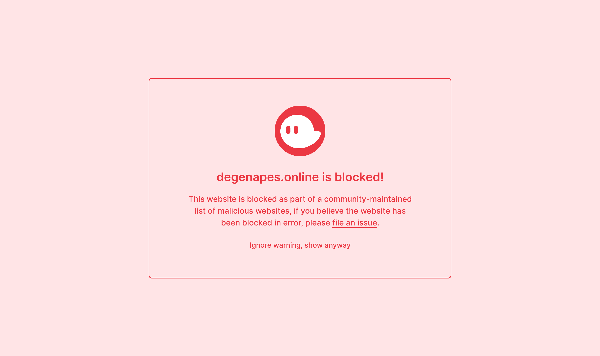
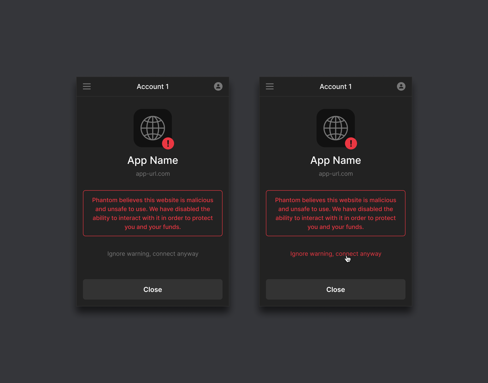

# High Level
This repository is the single source of truth for URLs that are flagged as malicious by the Phantom extension. When a user navigates to a URL that is listed in this repository, they will be redirected to the Phantom Blocklist Page.

The Phantom Blocklist Page will warn the user that the URL they are trying to navigate to has been flagged as malicious, provide a link to this repository, and provide a link the user can click on to navigate to the site anyway. If the user chooses to navigate to the URL anyway, the URL will be added to a local user whitelist and the extension will no longer redirect the user when they navigate to the site in the future.

In addition, if a dApp on a flagged URL tries to send a connection request to a user, the user will be presented with a warning on the connection screen that they are about to connect to a dApp that has been flagged as malicious. A user can choose to ignore this warning and connect anyway.

**NOTE**: The Phantom extension does **NOT** collect any user browsing data, the blocklist is stored locally in the extension and all URL checks are performed locally. Phantom will occasionally ping our own endpoint to download the latest version of the blocklist data so when a new URL is added it will be quickly reflected for all users. It will take less than 15 minutes for a new site added to the `blocklist.yaml` file to be blocked on all users browsers.

# Implementation
**NOTE**: The implementation for this code was inspired from the Metamask `eth-phishing-detect` library: https://github.com/MetaMask/eth-phishing-detect

There are three blocklist files in the codebase: `blocklist.yaml`, `fuzzylist.yaml`, and `whitelist.yaml`.

The `blocklist.yaml` is a list of URLs that are explicitly flagged as malicious. The `fuzzylist.yaml` file is a list of URLs for which any URL within a certain alphabetical distance will be automatically flagged as malicious. The `whitelist.yaml` file is a list of URLs that would otherwise be flagged by the fuzzylist, that we are explicitly whitelisting so they are not detected by the fuzzer.

**NOTE**: As of right now, we are **NOT** using the fuzzylist or whitelist files. We are only blocking specific URLs and not doing any alphabetical fuzzing. The functionality is there in case phishing becomes more rampant and harder to combat so we can have the ability to turn it on in the future.

The `blocklist.yaml` file is automatically deployed upon a commit/merge to the `master` branch and is the canonical source of truth for the live blocklist on the production version of Phantom.

# Integrations
This repository and its accompanying [NPM package](https://www.npmjs.com/package/@phantom-labs/blocklist) are **NOT** intended for use in client-side applications. Due to its ever-growing size, the blocklist has serious performance implications for any app that includes it in a browser-destined bundle.

If you are interested in integrating this blocklist into your project, please open an [issue](https://github.com/phantom-labs/blocklist/issues) that describes your intended use case.

# Contributing
If you would like to submit a URL to be added to the Phantom Blocklist, please open up a PR to the `master` branch of the repository. The PR should add an entry to the **bottom** of the `blocklist.yaml` file in the same format as other entries before it. The URL should **NOT** contain any protocol information such as `https://...` simply adding the URL is sufficient. Ideally either the commit message or the PR description should contain a description of why you are requesting that the site should be blocklisted, especially if it's not a clear phishing site that someone could discern from a quick glance.

In addition to the `url: ...` entry, any additional metadata can be added to a blocklist entry, such as a short `description: ...` of why the site should be blocklisted or the name of the person/organization that is requesting the site be blocklisted.

## Adding subdomains
_See this [Example PR](https://github.com/phantom-labs/blocklist/pull/333/files) for adding subdomains._

If you want to add a subdomain for a domain whose base url is non-malicious, follow these steps. For example, `github.io` is non-malicious, but `malicious.github.io` is a phishing website.

1) Check if the base domain is already in the `whitelist.yaml` file. If not, add the base non-malicious domain to the `whitelist.yaml` file, including a wildcard `*` subdomain, surrounding the url with quotes `""`. For example, add `- url: "*.github.io"`. This signals to the blocklist that `github.io` holds non-malicious subdomains, but may also include malicious subdomains as well.

_Important: Be sure to include the `*` subdomain and surround the url with quotes `""`. For example, [this line](https://github.com/phantom-labs/blocklist/blob/4fae828533cb93d43120b19871df889a02790680/whitelist.yaml#L5). you should add See as an example. else the malicious subdomains in the blocklist won't get picked up by the blocklist_.

2) Add the malicious subdomain to the `blocklist.yaml` file, including the entire subdomain. For example, add `malicious.github.io` to the blocklist file.
